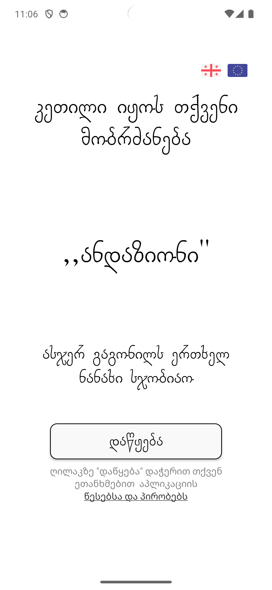

# Andazioni

Andazioni is an Android application aimed at providing users with a collection of Georgian proverbs. The app allows users to generate random proverbs with a single tap.

## Features

- **Random Proverb Generation**: Users can generate random proverbs with a single tap.
- **Share Proverbs**: Users can share their favorite proverbs with others easily.

## Screenshots

<div align="center">
    
     
    
    
</div>

## Status

This project is currently under development. Contributions are welcome! If you're interested in contributing, please check the [issues](https://github.com/DaviDM2005/Andazioni/issues) section or contact the developer at [datamamuladze@gmail.com](mailto:datamamuladze@gmail.com).

## Getting Started

To get started with the Andazioni project, follow these steps:

1. Clone the repository:
   ```bash
   git clone https://github.com/DaviDM2005/Andazioni.git
   ```
2. Open the project in Android Studio.
3. Build and run the project on an Android device or emulator.

## You can also download APK file.    [TAP HRE](https://drive.google.com/file/d/1TrlfWgWM3Y7jytMehoFKo_Md-S0w4qfw/view?usp=sharing)

## Contact

For any questions, feedback, or contributions, feel free to contact the developer:

- Developer: Davit Mamuladze
- Email: [datamamuladze@gmail.com](mailto:datamamuladze@gmail.com)

## License

This project is licensed under the [MIT License](LICENSE).

